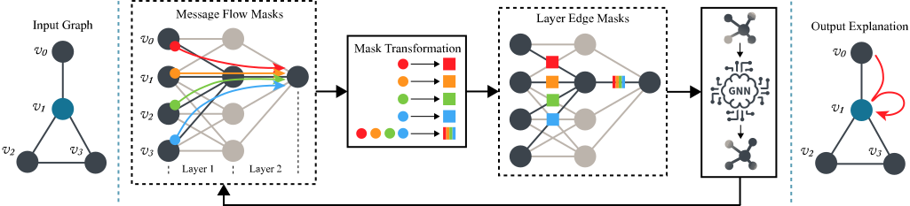

# Revelio

This repository contains the source code for the paper, **"Revelio: Revealing Important Message Flows in Graph Neural Networks"** by Haoyu He, Isaiah J. King and H. Howie Huang, presented at [ICDE 2025](https://ieee-icde.org/2025/).



## Requirements

We use [Pytorch Geometric 2.5.0](https://pytorch-geometric.readthedocs.io/en/stable/) (PyG) and later for implementation. Please follow the instruction to install PyG.

## Datasets

The datasets can be directly loaded from PyG or via `load_datasets.py`.

## Usage

### Configuring the experiment

We use `configs.py` to configure the experiment. Please check this file to see the complete list of options. 

### Specifications

Some explainers are borrowed from [DIG](https://diveintographs.readthedocs.io/en/latest/) and some are from PyG.
Use them by `*digex*` and `*pygex*` respectively.

`*_nc.py` and `*_gc.py` are codes for node classification and graph classification tasks respectively.

The trained models are saved in the `./src` folder. 

The explanation results are saved in the `./res` folder.

---

Here is an example of how this project works.

### Training a GNN model

To train a target model, run the following:

```
python train_nc.py --dataset cora --model gcn
```

The model will be saved in `./src`.

### Explain the model

```
python run_pygex_nc.py --dataset cora --model gcn --explainer revelio
```

The result will be saved in `./res/DATASET_NAME`

### Evaluate the explanation performance

```
python eval_nc.py --dataset cora --model gcn --explainer revelio
```
